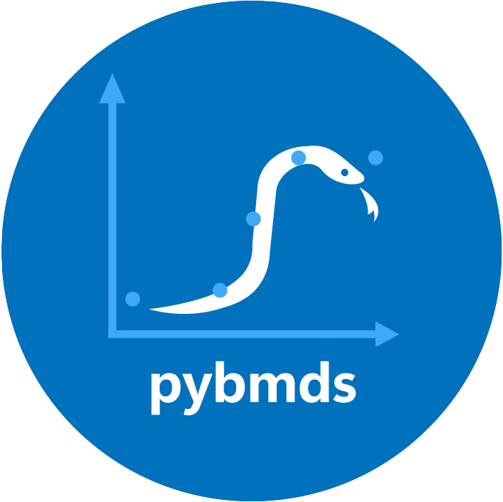

<p align="center" style="margin-top: 40px; margin-bottom: 40px;">
  
</p>

**pybmds** is a Python package for executing the U.S. EPA Benchmark Dose Modeling Software (BMDS).


::::{tab-set}
:::{tab-item} install with pip

```bash
pip install bmds
```

:::
:::{tab-item} install with conda

```bash
pip install bmds
```

:::
::::

**Highlights:**

* a
* b
* c

Add screenshots of a few things

# Contents

```{eval-rst}
.. toctree::
   :maxdepth: 2

   reference/index
   recipes/index
```

```{eval-rst}
.. toctree::
   :caption: Links
   :maxdepth: 2

   US EPA BMDS <https://epa.gov/bmds>
   Github <https://github.com/USEPA/bmds>
```
