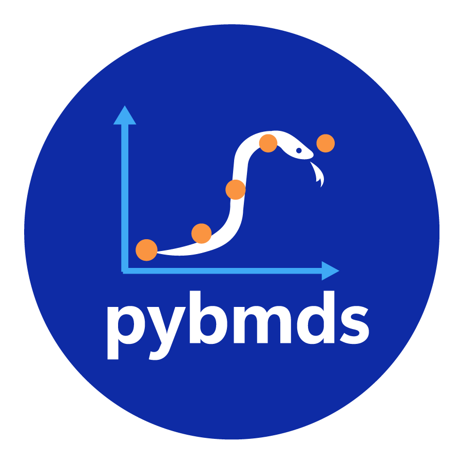

<p align="center" style="margin-top: 40px; margin-bottom: 40px;">
  
  
</p>

The U.S. EPA [BMDS Online](https://bmdsonline.epa.gov) is a web application that enables users to execute the Benchmark Dose Modeling Software using a Graphical User Interface (GUI) on your web browser, no installation required.

If you'd prefer to run the software on your computer, **BMDS Desktop** is the same application running locally. The Python package **bmds-ui** installs BMDS Desktop.

The Python package **pybmds** enables execution of dose-response models in a scripting environment. The package includes dose-response models for multiple types of dose-response data, including dichotomous, continuous, nested dichotomous, and cancer (including multitumor modeling). `pybmds` is the underlying execution engine for BMDS Online and BMDS Desktop.

**Highlights:**

* Dose-response modeling for multiple dataset types (continuous, dichotomous, nested dichotomous, cancer, multitumor)
* Plotting and summary table capabilities
* Model recommendation logic
* Reporting in Microsoft Excel and Microsoft Word reports
* Batch execution for multiple datasets or option set configuration

**If you are experienced with installing Python packages**, then enter the following command to install **BMDS Desktop** (which includes `pybmds`):

```bash
pip install bmds-ui
```

**If you are new to installing Python packages** and wish to BMDS Desktop or `pybmds`, then please follow the detailed [installation guide](./installation.md). The installation guide makes it easy to configure your computer, and describes possible issues and solutions that may arise during installation.


An example dose-response modeling session using `pybmds`:

```python
import pybmds

dataset = pybmds.DichotomousDataset(
   doses=[0, 10, 50, 150, 400],
   ns=[25, 25, 24, 24, 24],
   incidences=[0, 3, 7, 11, 15],
)
session = pybmds.Session(dataset=dataset)
session.add_default_models()
session.execute()
session.plot(colorize=True)
```

An example of the BMDS Desktop interface for saving and organizing multiple dose-response analyses:

```{figure} _static/img/bmds-desktop.jpg
:alt: Screenshot of BMDS Desktop Application
```

And a summary of outputs in BMDS Desktop showing model fit:

```{figure} _static/img/bmds-output.jpg
:alt: Screenshot of BMDS Desktop Dose Response Output
```


# Contents

```{eval-rst}
.. toctree::
   :maxdepth: 2

   installation
   desktop
   quickstart
   recipes/index
   logic
   development
   history
```

```{eval-rst}
.. toctree::
   :caption: Links
   :maxdepth: 2

   U.S. EPA BMDS <https://epa.gov/bmds>
   Github pybmds <https://github.com/USEPA/bmds>
   Github bmds-ui <https://github.com/USEPA/bmds-ui>
```

:::{important}

This software/application has been approved for release by the U.S. Environmental Protection Agency (USEPA). Although the software has been subjected to rigorous review, the USEPA reserves the right to update the software as needed pursuant to further analysis and review. No warranty, expressed or implied, is made by the USEPA or the U.S. Government as to the functionality of the software and related material nor shall the fact of release constitute any such warranty. Furthermore, the software is released on condition that neither the USEPA nor the U.S. Government shall be held liable for any damages resulting from its authorized or unauthorized use.

:::
